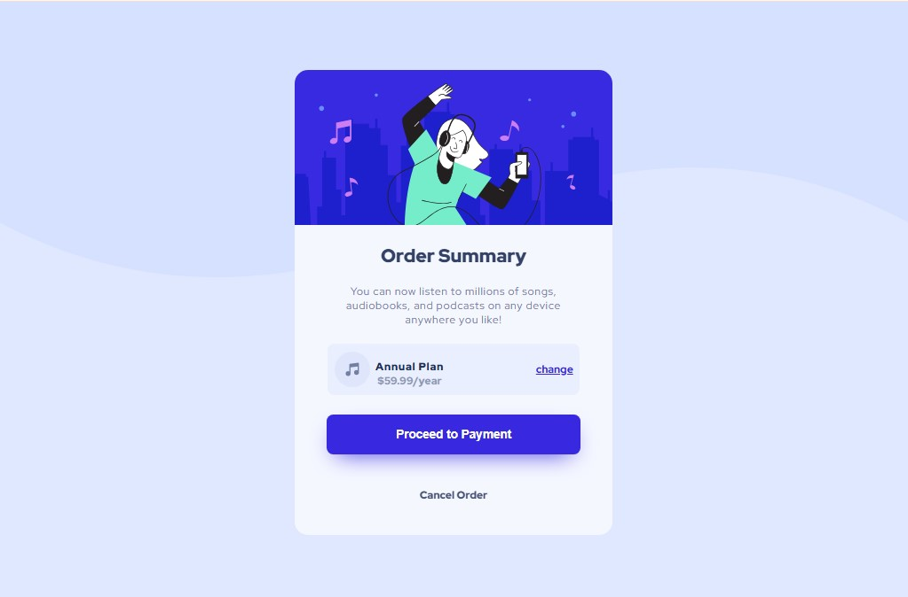

# Frontend Mentor - Order summary card solution

This is a solution to the [Order summary card challenge on Frontend Mentor](https://www.frontendmentor.io/challenges/order-summary-component-QlPmajDUj). Frontend Mentor challenges help you improve your coding skills by building realistic projects. 

## Table of contents

- [Overview](#overview)
  - [The challenge](#the-challenge)
  - [Screenshot]
  - [Links](https://github.com/H-wq-prog/order-summary-component.git)
- [My process](https://h-wq-prog.github.io/order-summary-component/)

- Solution URL:(https://github.com/H-wq-prog/order-summary-component.git)
- Live Site URL:(https://h-wq-prog.github.io/order-summary-component/)

### Built with

- Semantic HTML5 markup
- CSS custom properties
- Flexbox

- Website - (https://buildwithheidi.odoo.com/)
- Frontend Mentor -(https://www.frontendmentor.io/home)
- linked in - (https://www.linkedin.com/in/heidiramdan-4199b723a/)

